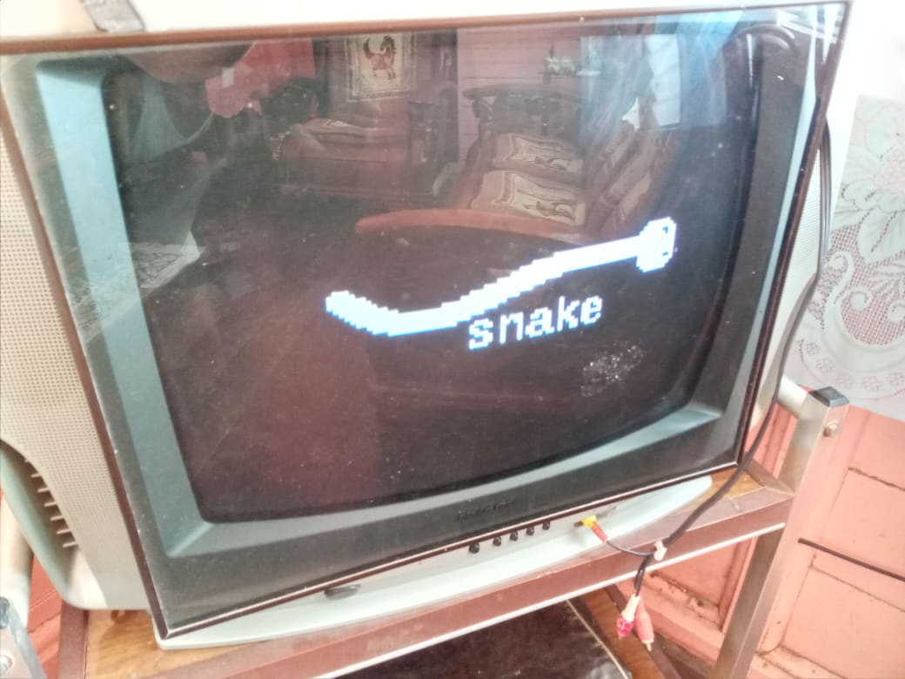
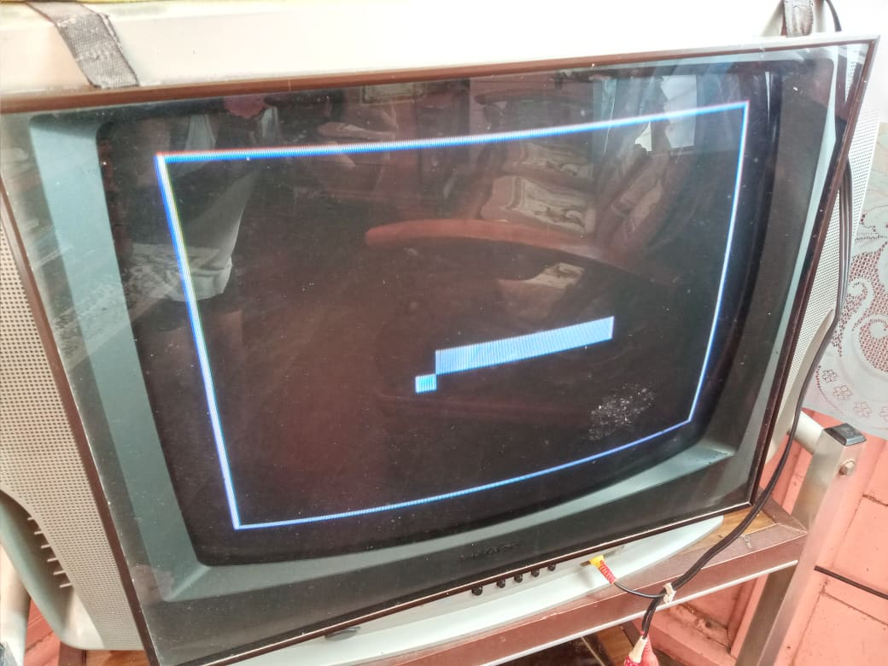
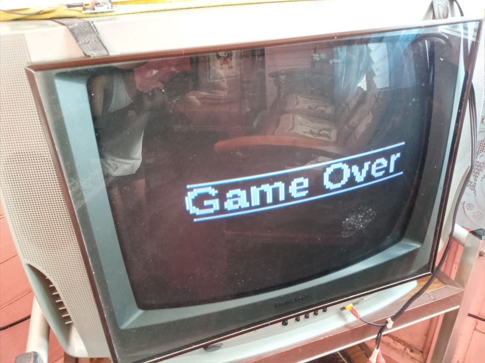
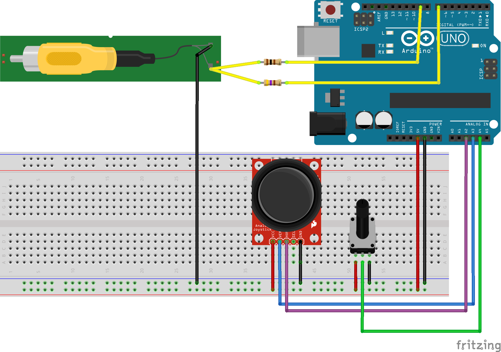

<!-- PROJECT SHIELDS -->
[![Contributors][contributors-shield]][contributors-url]
[![Forks][forks-shield]][forks-url]
[![Stargazers][stars-shield]][stars-url]
[![Issues][issues-shield]][issues-url]
[![MIT License][license-shield]][license-url]

<!-- PROJECT LOGO -->
 

  

<h3 align="center">tv-snake</h3>

  

    Play snake on an analog TV with Arduino
     
     
    <a href="https://github.com/jokomaxino/tv-snake/issues">Report Bug</a>
    ·
    <a href="https://github.com/jokomaxino/tv-snake/issues">Request Feature</a>
  

<!-- TABLE OF CONTENTS -->

  
Table of Contents

  <ol>
    <li><a href="#about-the-project">About The Project</a> </li>
    <li><a href="#getting-started">Getting Started</a></li>
    <li><a href="#contributing">Contributing</a></li>
    <li><a href="#license">License</a></li>
    <li><a href="#contact">Contact</a></li>
    <li><a href="#acknowledgments">Acknowledgments</a></li>
  </ol>

<!-- ABOUT THE PROJECT -->
## About The Project
 Play snake on an analog TV with Arduino.  
 
 **Demo video**  
  

**Screnshots**  
  
  
  

(<a href="#top">back to top</a>)

<!-- GETTING STARTED -->
## Getting Started

**Materials** 
 - Arduino Uno
 - potentiometer
 - wires
 - breadboard
 - joystick
 - analog TV (NTSC or PAL)
 - RCA cable
 

**Procedure**  
Install the Arduino IDE and copy the contents of libraries folder to your libraries. Wire an Arduino Uno this way:   
   

The default code works for an NTSC TV. If your have a PAL TV, change the line in [tv-snake.ino](snake/tv-snake.ino) that says   
        `TV.begin(NTSC, 120, 96);`  
to   
        `TV.begin(PAL, 120, 96);`  

NTSC or PAL depends on what country you are in.  

Enjoy!

(<a href="#top">back to top</a>)

<!-- CONTRIBUTING -->
## Contributing

This isn't perfect, but it looks good. Any contributions you make are **greatly appreciated**.

If you have a suggestion that would make this better, please fork the repo and create a pull request.

(<a href="#top">back to top</a>)

<!-- LICENSE -->
## License

Distributed under the MIT License. See `LICENSE.txt` for more information.

(<a href="#top">back to top</a>)

<!-- CONTACT -->
## Contact

Jose Enrico Maxino - jokomaxino@gmail.com

(<a href="#top">back to top</a>)

<!-- ACKNOWLEDGMENTS -->
## Acknowledgments

* Code for the game was based on [snake for 8x8 LED matrix](https://create.arduino.cc/projecthub/rishab8551/arduino-snake-game-using-arduino-and-martix-6c230c)
* [TVout Library](https://www.arduino.cc/reference/en/libraries/tvout/) used for drawing to the screen.

(<a href="#top">back to top</a>)

<!-- MARKDOWN LINKS & IMAGES -->
[contributors-shield]: https://img.shields.io/github/contributors/jokomaxino/tv-snake.svg?style=for-the-badge
[contributors-url]: https://github.com/jokomaxino/tv-snake/graphs/contributors
[forks-shield]: https://img.shields.io/github/forks/jokomaxino/tv-snake.svg?style=for-the-badge
[forks-url]: https://github.com/jokomaxino/tv-snake/network/members
[stars-shield]: https://img.shields.io/github/stars/jokomaxino/tv-snake.svg?style=for-the-badge
[stars-url]: https://github.com/jokomaxino/tv-snake/stargazers
[issues-shield]: https://img.shields.io/github/issues/jokomaxino/tv-snake.svg?style=for-the-badge
[issues-url]: https://github.com/jokomaxino/tv-snake/issues
[license-shield]: https://img.shields.io/github/license/jokomaxino/tv-snake.svg?style=for-the-badge
[license-url]: https://github.com/jokomaxino/tv-snake/blob/master/LICENSE.txt
